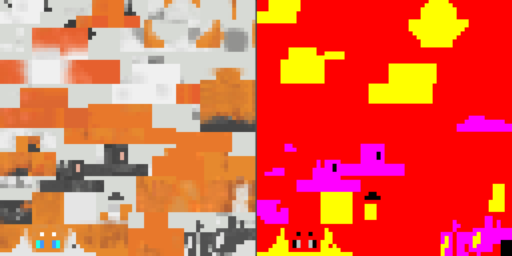

# 为自定义形态加入换色功能

为了让你的自定义形态支持颜色配置功能，你需要制作一张colormask贴图，并在`assets/orif-defaults/furs/example_namespace.form_example.json`模型配置文件中进行注册

## 创建colormask贴图



colormask贴图以你的形态贴图为基础创建而来。它使用颜色通道标记各个自定义颜色配置的生效区域：

|  通道  |  R  |  G   |  B   | A(value = 0) | A(value = 1) |
|:----:|:---:|:----:|:----:|:------------:|:------------:|
| 对应区域 | 主要色 | 强调色1 | 强调色2 |    眼睛颜色1     |    眼睛颜色2     |

在颜色配置生效时，颜色的写入顺序为主要色->强调色1->强调色2->眼睛颜色，后者会覆盖前者

模组会在创建自定义颜色临时贴图时自动混合原有纹理。colormask只做区域标注使用，保持纯色即可

## 注册OriginFur模型配置文件

在colormask完成后，你还需要对其进行注册

```
{
  "model": "orif-defaults:geo/form_allay_sp.geo.json",
  "texture": "orif-defaults:textures/form_allay_sp/form_allay_sp.png",
  "texture_mask": "orif-defaults:textures/form_allay_sp/form_allay_sp_colormask.png",
  "overlay": "orif-defaults:textures/form_allay_sp/form_allay_sp_overlay.png",
  "overlay_mask": "orif-defaults:textures/form_allay_sp/form_allay_sp_overlay_colormask.png",
  "hidden": [
    "leftLeg",
    "rightLeg",
    "rightPants",
    "leftPants",
    "body",
    "jacket"
  ],
  "tail_chain": {
    "tail_l": [0],
    "tail_r": [0]
  },
  "wing_chain_l": {
    "wing_l": [0, 1]
  },
  "wing_chain_r": {
    "wing_r": [0, 1]
  },
  "tail_chain_head": {
    "head_tail_l": [0, 1],
    "head_tail_r": [0, 1]
  }
}
```

根据你的贴图类型，在`texture_mask`，`overlay_mask`或`fullbrightTexture_mask`字段注册你的colormask贴图路径

如此一来，换色功能应能在你的自定义形态中生效