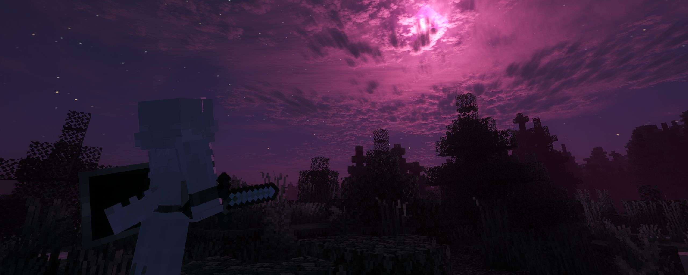

在世界中，有多种物品与事件可以影响你当前的形态

# 诅咒之月事件

每隔一段时间，当时间处于夜晚时可能会触发`诅咒之月事件`。这一事件是全局的

对于1.0.6版本以及以上的版本，诅咒之月事件被设定为在固定的月相触发。触发间隔时间在2-3天（之前的触发方式bug实在太多了！）

`诅咒之月事件`会持续一整夜。这一事件会造成一系列影响：

- 生物会掉落`未加工的月尘`

- 当处于`初始形态`时，你的形态会随机变为某个`阶段变化形态`的第一阶段，`诅咒之月事件`结束即复原

- 当处于`阶段变化形态`的1,2阶段时，你的形态会暂时增加一个阶段，`诅咒之月事件`结束即复原

- 当处于`阶段变化形态`的第3阶段时，你的形态会暂时恢复到这一形态的第1阶段，`诅咒之月事件`结束即复原。这也是您使用`抑制剂`复原的机会