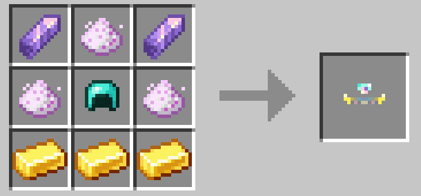
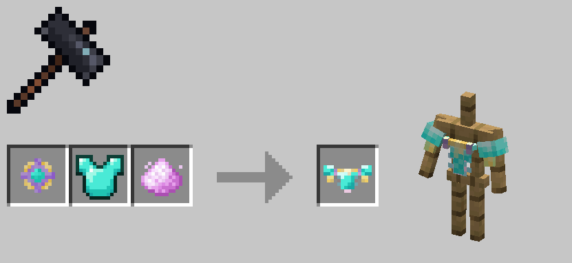
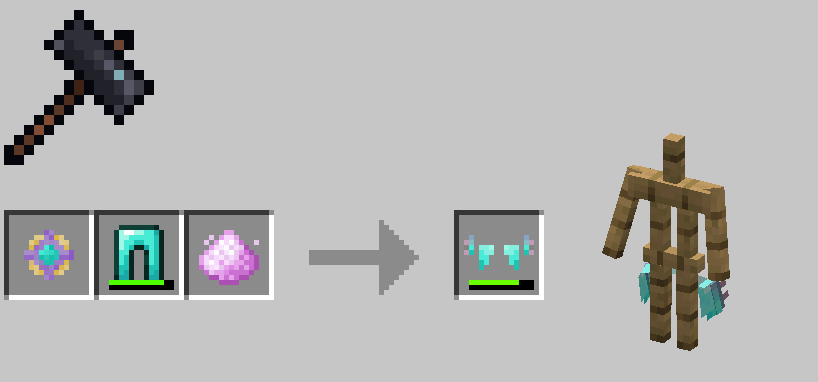
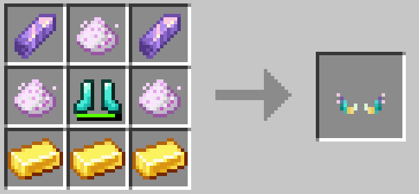

# 塑形盔甲

塑形盔甲在1.0.71版本后加入。它们是游戏中后期的盔甲，可以无视形态的盔甲相关限制，被绝大多数形态装备

在1.0.73版本后，塑形盔甲的合成方式由直接合成变为锻造台锻造，以保留原本装备的附魔

你需要先合成塑形核心，并在锻造台中使用对应钻石装备，塑形核心与未加工的月尘合成塑形护甲

!!! note

	出于显而易见的原因，allay_sp无法装备塑形绑腿与塑形脚镯

---

### 塑形核心

### 塑形头环

| 护甲值 | 盔甲韧性 | 耐久度 |
|:---:|:----:|:---:|
|  2  |  1   | 264 |

### 塑形身甲

| 护甲值 | 盔甲韧性 | 耐久度 |
|:---:|:----:|:---:|
|  7  |  1   | 384 |

### 塑形绑腿

| 护甲值 | 盔甲韧性 | 耐久度 |
|:---:|:----:|:---:|
|  6  |  1   | 360 |

### 塑形脚镯

| 护甲值 | 盔甲韧性 | 耐久度 |
|:---:|:----:|:---:|
|  2  |  1   | 312 |

# 塑形盔甲下界合金升级

1.8.1版本后加入了塑形盔甲的下界合金升级

与原版不同的是，下界合金塑形盔甲的升级与修理使用`下界合金碎片`即可，无需`下界合金锭`

### 下界合金塑形头环

| 护甲值 | 盔甲韧性 | 耐久度 |
|:---:|:----:|:---:|
|  3  |  1   | 481 |

### 下界合金塑形身甲

| 护甲值 | 盔甲韧性 | 耐久度 |
|:---:|:----:|:---:|
|  8  |  1   | 592 |

### 下界合金塑形绑腿

| 护甲值 | 盔甲韧性 | 耐久度 |
|:---:|:----:|:---:|
|  7  |  1   | 555 |

### 下界合金塑形脚镯

| 护甲值 | 盔甲韧性 | 耐久度 |
|:---:|:----:|:---:|
|  3  |  1   | 462 |

# 护甲与工具的塑形属性升级

在1.8.1版本之后，你可以为包含其他模组添加的任意工具与护甲塑形加入塑形属性升级

有塑形属性的工具与护甲可以无视限制，被大部分形态使用与装备。只是由于无法对所有模组内容做适配，一些护甲可能会出现穿模现象

你需要在锻造台中使用`塑形核心`与`下界之星`来进行进行塑形属性升级

