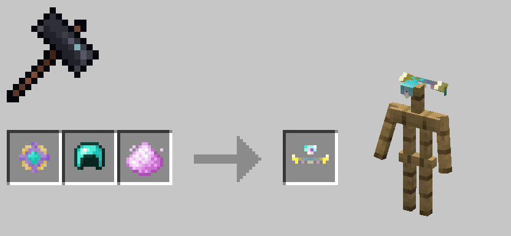

# 塑形盔甲

塑形盔甲在1.0.71版本后加入。它们是游戏中后期的盔甲，可以无视形态的盔甲相关限制，被绝大多数形态装备

你需要使用未加工的月尘，金锭，紫水晶碎片与对应的钻石护甲来合成塑形护甲

!!! note

	出于显而易见的原因，allay_sp无法装备塑形绑腿与塑形脚镯

---

### 塑形头环

| 护甲值 | 盔甲韧性 | 耐久度 |
|:---:|:----:|:---:|
|  1  |  1   | 264 |

### 塑形身甲

| 护甲值 | 盔甲韧性 | 耐久度 |
|:---:|:----:|:---:|
|  6  |  1   | 384 |

### 塑形绑腿

| 护甲值 | 盔甲韧性 | 耐久度 |
|:---:|:----:|:---:|
|  4  |  1   | 360 |

### 塑形脚镯

| 护甲值 | 盔甲韧性 | 耐久度 |
|:---:|:----:|:---:|
|  2  |  1   | 312 |