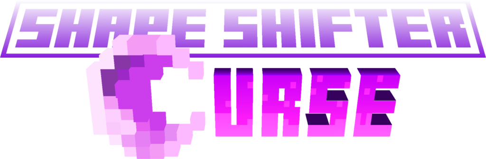
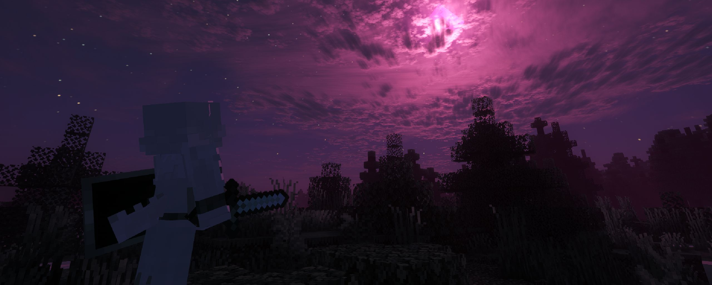
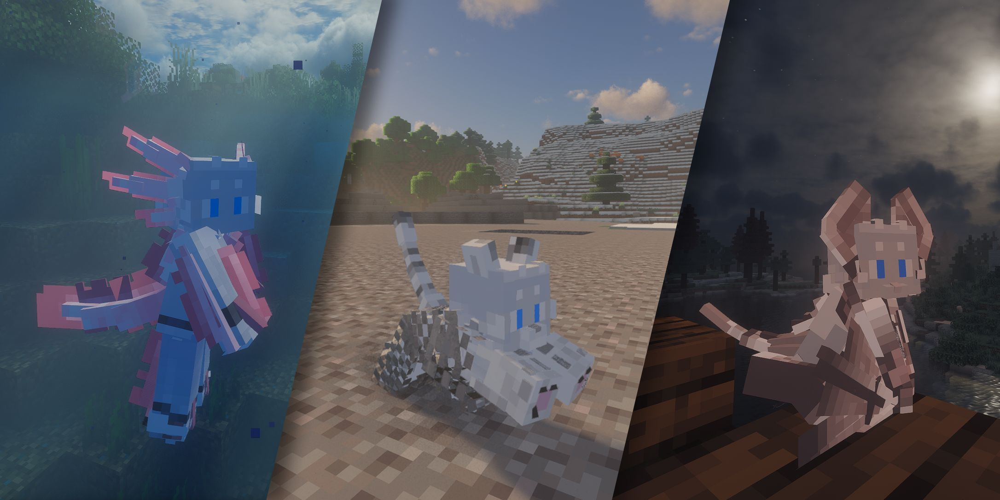
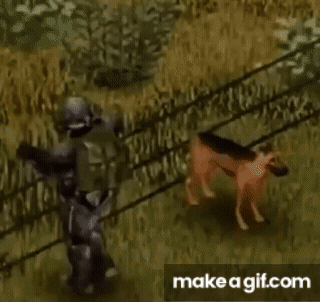

### 描述

某种未知的魔力涌入了你的身体…当诅咒之月升起时，某些变化从你的身上显现出来

这一mod允许玩家在“诅咒之月”与“本能”机制的影响下，逐渐转变成基于原版生物设计的不同形态，并获取它们特有的能力与劣势

每种形态都有独立的模型与以及（可能的）特殊动画，其能力与劣势也经过设计与平衡，来尽可能在尊重游戏原本体验的情形下添加有趣的特色

### 形态列表

请参考wiki中的相关条目

### 特性

#### 经过测试与验证的游玩体验

平衡本身就是乐趣——形态的能力与劣势经过多次迭代与大量时间的测试，来尽可能在尊重游戏原本体验的情形下添加有趣的特色

#### 精心设计的模型与动画

不需要只停留于想象中——每种形态都有自己的模型，乃至与之相称的状态动画

#### 制作自定义的形态与能力

加入你自己的想法——虽然有一点限制，不过你可以通过数据包+资源包的方式来自定义属于自己的形态，包括模型、特有能力、instinct变化与描述文本

请参考文档与源码中的示例

### 我要如何开始？

请阅读mod的Wiki文档

### 安装

#### 需要的mod

抱歉，这是一个有点长的列表：

- [PlayerAbilityLib](https://www.curseforge.com/minecraft/mc-mods/pal)

- [Cardinal Components API](https://www.curseforge.com/minecraft/mc-mods/cardinal-components-api)

- [Cloth Config API](https://www.curseforge.com/minecraft/mc-mods/cloth-config)

- [Azurelib](https://www.curseforge.com/minecraft/mc-mods/azurelib)

- [Pehkui](https://www.curseforge.com/minecraft/mc-mods/pehkui)

- [Forge Config API Port](https://www.curseforge.com/minecraft/mc-mods/forge-config-api-port-fabric)

- [Satin API](https://www.curseforge.com/minecraft/mc-mods/satin-api)

### 建议安装的mod

[First-person Model](https://www.curseforge.com/minecraft/mc-mods/first-person-model)

在1.0.63版本后，玩家模型可以在原版第一人称下正常显示，但是依然建议安装First-person Model以获得更好的沉浸感

#### 有可能不兼容的mod

AnimationOverhul、Emotecraft等修改角色动画的mod，以及YSM等修改角色模型的mod很有可能与本mod不兼容。它们不一定会导致逻辑冲突，但是同时使用它们会破坏mod中的动画与模型

    

    *尤其是对于四足形态而言...*

另外，BetterCombat等修改战斗机制的mod可能会导致一些与战斗相关的形态能力的判定出现一些问题

### FAQ：

- **我的角色皮肤被替换了？**

    在开启mod内容之后，玩家的角色皮肤将被替换为mod内置的角色皮肤(aka: the shifter)，这是出于形态模型的美术一致性，以及尊重他人角色的考虑

    你可以通过游戏中的指令`/shape-shifter-curse keep_original_skin true`来使用你自己的皮肤

- **它是否适用于服务器？**

   是的！

   在1.0.5版本后，mod已经实现了服务器兼容。如果您发现了问题，请提issue

- **我不喜欢firstPerson的第一人称效果**

    在1.0.63版本后，玩家模型可以在原版第一人称下正常显示。First-person Model模组不再作为强制依赖

- **我可以自定义自己的形态么？**

    是的。虽然有一点限制，不过你可以通过数据包+资源包的方式来自定义属于自己的形态，包括模型、特有能力、instinct变化与描述文本

    请参考wiki文档与源码中的示例

- **我要怎么变成其他形态？**

   在mod流程中，你可以通过成就系统与合成表来获取相关提示 

   如果仍有疑问，请参考wiki文档

- **某个形态是永久性的么？**

    1\.0.4版本之后添加了几个永久保持的形态

   请参考mod文档

- **我不小心遗失了幻形者之书**

    你可以使用未加工的月尘+书本重新合成

- **这个mod是SFW的么？**

    当然！

### 特别感谢

Origins 与 Origin Furs

这是我的第一个mod项目，没有它们作为基石，这些想法想必难以变成现实